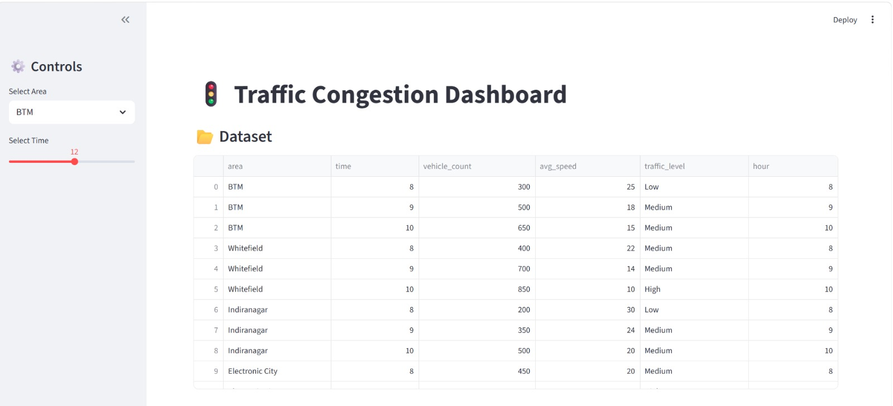
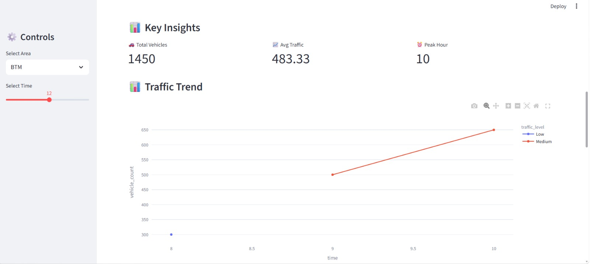

#Customer Segmentation using K-Means Clustering

## Project Overview
This project uses Machine Learning to group customers based on:
- Annual Income
- Spending Score

## Technologies Used
- Python
- Pandas
- Matplotlib
- Scikit-learn
- Jupyter Notebook

## Machine Learning Algorithm
K-Means Clustering

## Project Screenshots

## Features
- Data preprocessing
- Elbow Method
- Customer segmentation
- Data visualization

## Project Output
The model groups customers into different clusters for business analysis.

## Author
Bhuvana Sree
